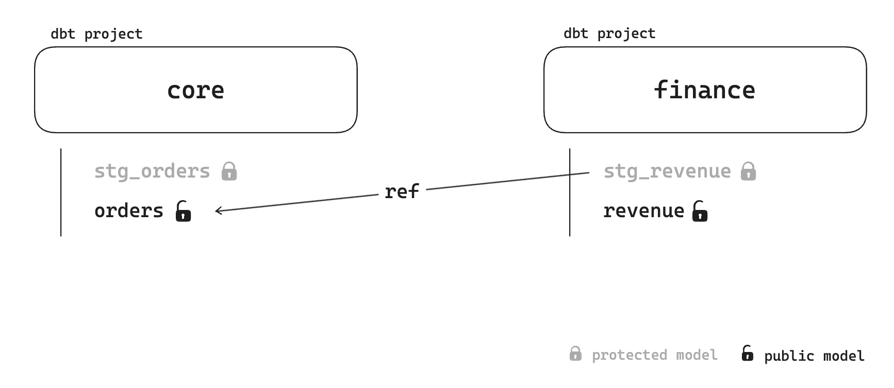

# Example setup for dbt-loom

This repository showcase how you can use dbt-loom to setup multi-project collaboration with dbt Core and **without dbt Cloud**.


## Installation

In order to have the example working you need a few steps.

* Have a working Python virtualenv
* Install dbt-duckdb, minimal dbt version should be 1.6
    ```
    pip install dbt-duckdb==1.6.1
    ```
* Install dbt-loom — for the example we only use one virtualenv for both project, but in real life it will be different.
    ```bash
    pip install dbt-loom
    ```
* First you need to run the dbt core project, as the link between the 2 project is for the moment done by reading the local manifest.
    ```bash
    cd core
    dbt build
    ```
* It should work, load a seed, run 2 models and create a warehouse.duckdb file in the root folder.
* Then you can run the finance project
    ```bash
    cd ../finance
    dbt build
    ```
* You're done.
* You should be able to see the table you have created with DuckDB. Run `show tables;`.
    ```bash
    duckdb ../warehouse.duckdb
    D show tables;
    ┌─────────────┐
    │    name     │
    │   varchar   │
    ├─────────────┤
    │ margins     │
    │ orders      │
    │ raw_orders  │
    │ revenue     │
    │ stg_orders  │
    │ stg_revenue │
    └─────────────┘
    ```